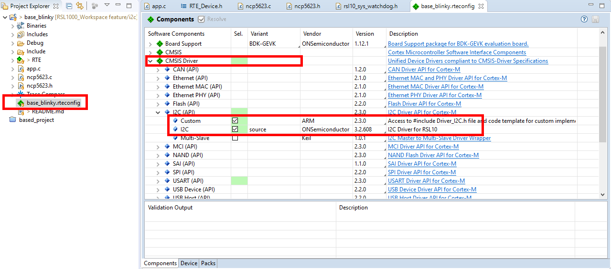
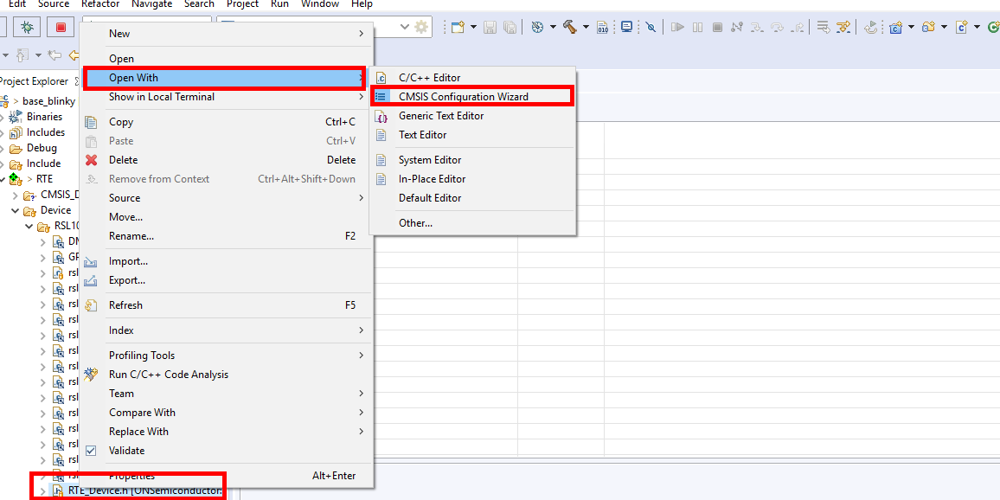
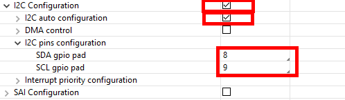
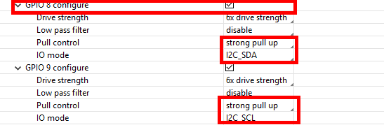

# I2C sample code

## Introduction
This sample code will show you how to setup and running I2C on RSL1000 board. It is demonstrated by interfacing the RGB LED driver NCP5623 from OnSemi

## How-to
* Add I2C CMSIS driver into the project

* Configure the I2C and Pin instance

* Please refer the sample code for the implemetation  

## Changelog

### Version 1.0.0
* Initialize version

## Todo
* Write the README in a formal way

## Contact
Quang Hai Nguyen

qnguyen@arroweurope.com